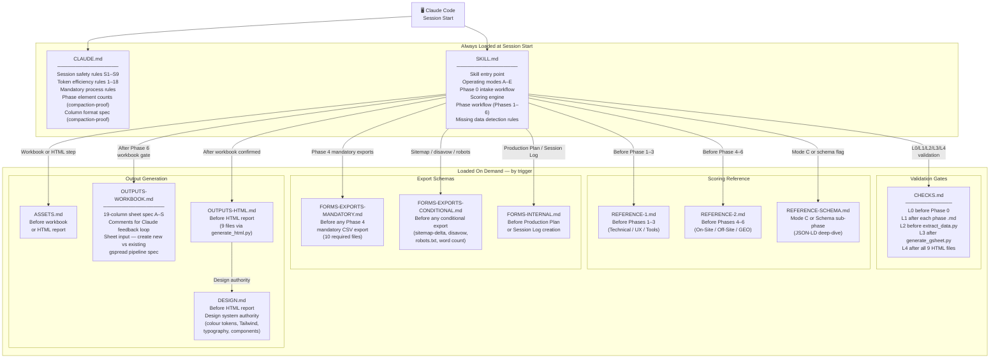
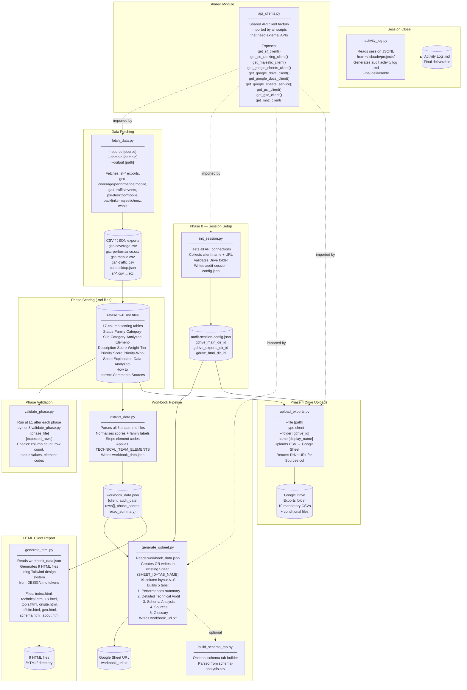
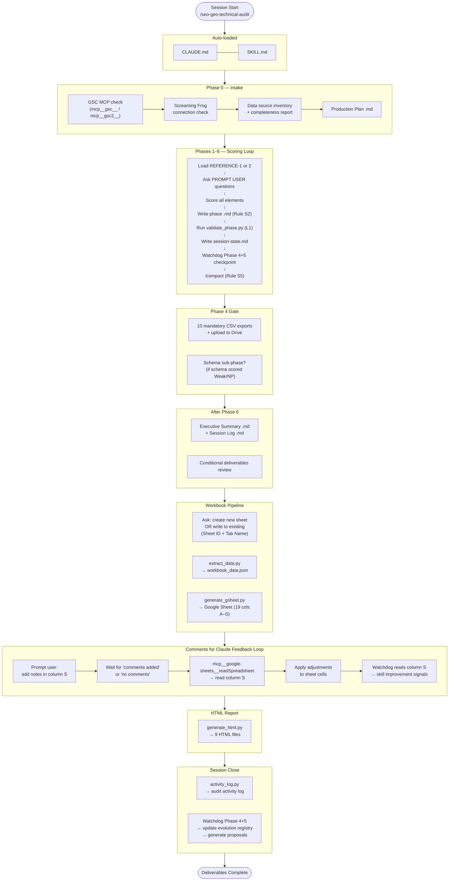

# SEO & GEO Technical Audit — Skill Architecture
**Version:** 14.0 | **Last updated:** May 2026

This document maps every component of the skill: .md files and when they load, the script data pipeline, and all external integrations (MCP connectors + API keys via .env).

---

## Diagram 1 — .md File Architecture

Shows which files are loaded, by whom, and at what trigger point.

---

## Diagram 2 — Script Data Pipeline

Shows how Python scripts connect, what each produces, and what the next step consumes.

---

## Diagram 3 — External Integrations

Shows all MCP connectors (used by Claude directly) and Python API keys (used by scripts via api_clients.py).

```mermaid
flowchart LR
    subgraph CLAUDE_MCP["MCP Connectors — used by Claude directly"]
        direction TB

        subgraph GSC_MCP["Google Search Console"]
            MG1["mcp__gsc__\n─────────────────\nPhase 0 Part 0\nProperty access check\nlist_properties\nperformance_overview\nsearch_analytics\nindexing_coverage\ninspect_url"]
            MG2["mcp__gsc2__\n─────────────────\nFallback if mcp__gsc__\ndoes not find property\nSame tools available"]
        end

        subgraph SHEETS_MCP["Google Sheets"]
            MS["mcp__google-sheets__\n─────────────────\nreadSpreadsheet\n→ reads column S\n  (Comments for Claude)\n  during feedback loop\nwriteSpreadsheet\n→ applies adjustments\n  from column S comments"]
        end

        subgraph DOCS_MCP["Google Docs / Drive"]
            MD["mcp__google-docs__\n─────────────────\nlistDriveFiles\nsearchDriveFiles\nreadDocument\n(reference use)"]
            MGD["mcp__gdrive__\n─────────────────\nsearch\n(file lookup)"]
        end

        subgraph GA4_MCP["Google Analytics"]
            MGA["mcp__ga4__\n─────────────────\nga4_run_report\nga4_realtime_report\nga4_performance_overview\n(reference — primary source\nis fetch_data.py API)"]
        end

        subgraph SER_MCP["SE Ranking"]
            MSE["mcp__claude_ai_SE_Ranking__\n─────────────────\nDATA_getDomainKeywords\nDATA_getSerpResults\nDATA_getAiOverview\nPROJECT_getGoogleSearchConsole\nPROJECT_getAuditReport\n(interactive use for\nG01–G02, G07, G26\nSE Ranking AI Visibility)"]
        end
    end

    subgraph PYTHON_API["Python API Clients — scripts/api_clients.py + .env"]
        direction TB

        subgraph SF_API["Screaming Frog REST API"]
            SF["SF_API_URL\n(default: localhost:8775)\n─────────────────\nUsed by: fetch_data.py\ninit_session.py\n\nEndpoints:\n/crawl/start\n/crawl/status\n/export/[tab]"]
        end

        subgraph GOOGLE_API["Google APIs — Service Account"]
            GSA["GOOGLE_SERVICE_ACCOUNT_JSON\n─────────────────\nOne JSON key file\nauthorises all 4 Google services:\n\n• Google Sheets API v4\n  (gspread + batchUpdate)\n• Google Drive API v3\n  (file move, folder, upload)\n• Google Docs API v1\n  (robots.txt, disavow docs)\n• Google Search Console API\n  (coverage, performance, CWV)"]
            GSCENV["GSC_CLIENT_SECRETS_JSON\nGSC_PROPERTY_URL\n─────────────────\nOAuth credentials for\nGSC API (fetch_data.py)\nused when service account\ndoes not have GSC access"]
            DRIVEIDS["Drive Folder IDs\n─────────────────\nGDRIVE_MAIN_DIR_ID\n→ workbook destination\nGDRIVE_EXPORTS_DIR_ID\n→ Phase 4 CSV exports\nGDRIVE_HTML_DIR_ID\n→ HTML report files"]
        end

        subgraph GA4_API["Google Analytics 4"]
            GA4["google.analytics.data_v1beta\n─────────────────\nClient: BetaAnalyticsDataClient\nAuth: service account JSON\nUsed by: fetch_data.py\n\nFetches:\nga4-traffic.csv\nga4-events.csv"]
        end

        subgraph PSI_API["PageSpeed Insights"]
            PSI["PSI_API_KEY\n─────────────────\nGoogle PageSpeed Insights\nAPI v5\nUsed by: fetch_data.py\n\nFetches:\npsi-desktop.json\npsi-mobile.json"]
        end

        subgraph BACKLINKS_API["Backlink APIs"]
            MAJ["MAJESTIC_API_KEY\n─────────────────\nMajestic API\nDomain metrics,\nbacklink counts,\ntrust/citation flow"]
            MOZ["MOZ_ACCESS_ID\nMOZ_SECRET_KEY\n─────────────────\nMoz Links API v2\nHMAC auth\nDomain Authority,\nSpam Score,\nbacklinks-moz export"]
        end

        subgraph SEO_API["SEO Data APIs"]
            SER["SE_RANKING_API_KEY\n─────────────────\nSE Ranking REST API\nUsed by: fetch_data.py\n\nFetches:\nse-ranking-aio.csv\nse-ranking-aivisibility.csv"]
            WHO["WHOIS_API_KEY\n─────────────────\nWHOIS REST API\nUsed by: fetch_data.py\n\nFetches:\nwhois.txt\n(domain age, registrar,\nDNSSEC, expiry)"]
        end
    end

    subgraph PHASE0T["Phase 0 — Trigger Points"]
        P0["Part 0: GSC check\n→ MCP first"]
        P0B["Step 4 inventory\n→ Scripts for missing data"]
    end

    P0 --> MG1
    MG1 -.->|"fallback"| MG2
    P0B --> SF
    P0B --> GSA
    P0B --> GA4
    P0B --> PSI
    P0B --> MAJ
    P0B --> MOZ
    P0B --> SER
    P0B --> WHO
```

---

## Diagram 4 — End-to-End Session Flow

A condensed view showing the full audit journey from session start to final deliverables.

---

## Quick Reference — File Load Matrix

| File | Loaded by | Trigger | Contents |
|---|---|---|---|
| CLAUDE.md | Claude Code | Auto (session start) | Safety rules, token rules, process rules, column spec |
| SKILL.md | Claude Code | Auto (session start) | Main workflow, scoring engine, modes, phase flow |
| CHECKS.md | SKILL.md | L0/L1/L2/L3/L4 gates | Validation checklists at 5 pipeline points |
| REFERENCE-1.md | SKILL.md | Before Phase 1, 2, or 3 | Element scoring guides for Technical / UX / Tools |
| REFERENCE-2.md | SKILL.md | Before Phase 4, 5, or 6 | Element scoring guides for On-Site / Off-Site / GEO |
| REFERENCE-SCHEMA.md | SKILL.md | Mode C or schema flag | Schema JSON-LD deep-dive spec |
| FORMS-EXPORTS-MANDATORY.md | SKILL.md | Before any Phase 4 export | 10 mandatory CSV schemas (title tags, redirects, etc.) |
| FORMS-EXPORTS-CONDITIONAL.md | SKILL.md | Before conditional export | Sitemap-delta, disavow, robots.txt, word count schemas |
| FORMS-INTERNAL.md | SKILL.md | Production Plan or Session Log | Internal tracking file schemas |
| ASSETS.md | SKILL.md | Before workbook or HTML | Site-type weight table, brand assets, score matrix |
| OUTPUTS-WORKBOOK.md | SKILL.md | Workbook generation gate | 19-column spec, feedback loop, sheet input options |
| OUTPUTS-HTML.md | SKILL.md | HTML report gate | HTML report structure, 9-file spec |
| DESIGN.md | OUTPUTS-HTML.md | Before HTML generation | Tailwind tokens, typography, component rules |
| README.md | Human only | Reference | Operator guide, setup instructions |

---

## Quick Reference — Script Dependency Matrix

| Script | Imports | Reads | Writes | External API |
|---|---|---|---|---|
| api_clients.py | os, requests, dotenv | .env file | — | All APIs (factory) |
| init_session.py | api_clients, json, os | .env, CLI args | audit-session-config.json | SF, Google Drive, GSC, GA4 |
| fetch_data.py | api_clients, csv, json | .env, --source args | CSV/JSON exports | SF, SE Ranking, PSI, GSC, GA4, Majestic, Moz, WHOIS |
| validate_phase.py | json, re, os | phase .md file | validation report | None |
| extract_data.py | json, re, os | phase 1–6 .md files | workbook_data.json | None |
| generate_gsheet.py | api_clients, gspread, json | workbook_data.json, audit-session-config.json | Google Sheet, workbook_url.txt | Google Sheets API, Drive API |
| build_schema_tab.py | csv, json | schema-analysis.csv | schema tab in sheet | Google Sheets API |
| upload_exports.py | api_clients | CSV files | Google Drive (Sheets) | Google Drive API, Sheets API |
| generate_html.py | json, os, re | workbook_data.json | 9 HTML files | None |
| activity_log.py | json, os, re | JSONL session files | activity log .md | None |

---

## Quick Reference — API Key / .env Variables

| Variable | Used by | Service | Purpose |
|---|---|---|---|
| GOOGLE_SERVICE_ACCOUNT_JSON | api_clients.py | Google APIs | Path to service account JSON — authorises Sheets, Drive, Docs, GSC |
| GSC_CLIENT_SECRETS_JSON | init_session.py, fetch_data.py | Google Search Console | OAuth fallback for GSC API |
| GSC_PROPERTY_URL | fetch_data.py | Google Search Console | Target property for data fetches |
| GDRIVE_MAIN_DIR_ID | generate_gsheet.py | Google Drive | Folder ID for workbook |
| GDRIVE_EXPORTS_DIR_ID | upload_exports.py | Google Drive | Folder ID for Phase 4 CSV exports |
| GDRIVE_HTML_DIR_ID | upload_exports.py | Google Drive | Folder ID for HTML report |
| SF_API_URL | api_clients.py | Screaming Frog | REST API base URL (default: localhost:8775) |
| SE_RANKING_API_KEY | api_clients.py | SE Ranking | API key for keyword + AI visibility data |
| MAJESTIC_API_KEY | api_clients.py | Majestic | Backlink domain metrics |
| MOZ_ACCESS_ID | api_clients.py | Moz Links API v2 | Domain Authority, Spam Score |
| MOZ_SECRET_KEY | api_clients.py | Moz Links API v2 | HMAC auth partner key |
| PSI_API_KEY | api_clients.py | PageSpeed Insights | Core Web Vitals + performance scores |
| WHOIS_API_KEY | api_clients.py | WHOIS REST API | Domain age, registrar, DNSSEC |

---

*outline.md | seo-geo-technical-audit | Version 14 | May 2026*
